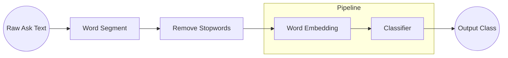

# Data Mining Mid-term Report 分類

<!-- ## **Installation**
not done yet :(
```bash
git clone https://github.com/BennyWang4000/DataMiningMid_Classification.git
```
```bash
python setup.py install
```
## **Usage**
not done either :(
```python
doc= ''
foo(doc, lang='t')
``` -->

<!-- # **More Detail** -->
## **Table of Contents**
1. [Introduce](#1-introduce)
2. [Clean Data](#2-clean-data)
3. [Text Process](#3-text-process)
4. [Pipeline](#4-pipeline)
5. [Word Embedding](#5-word-embedding)
6. [Classification](#6-classification)
7. [Result](#7-result)
8. [Discussion](#8-discussion)
9. [Reference](#9-reference)

## **1. Introduce**
在期中以前教利用各式演算法依據資料特性做分群或分類。
那我想利用大量的已標記文本，同樣做出分類效果。

利用 Sklearn 完成能依字詞分類的分類器，將醫療問題分類為內科與外科中的子科目。
## **2. Clean Data**

資料集選用了使用github上的簡體中文資料集

> **Dataset from Toyhom Chinese-medical-dialogue-data** \
> repo: https://github.com/Toyhom/Chinese-medical-dialogue-data 

裡面總共有五種科別，對應到每一個 csv，分別為內科、婦產科、腫瘤科、兒科、外科。內容為醫療相關的問題與其回答，欄位有以下
department|title|ask|answer
---|---|---|---
科別名稱|標題|問題|回答

例子
department|title|ask|answer
---|---|---|---|
心血管科|高血压患者能吃党参吗？|我有高血压这两天女婿来的时候给我拿了些党参泡水喝，您好高血压可以吃党参吗？|高血压病人可以口服党参的。党参有降血脂，降血压的作用，可以彻底消除血液中的垃圾，从而对冠心病以及心血管疾病的患者都有一定的稳定预防工作作用，因此平时口服党参能远离三高的危害。另外党参除了益气养血，降低中枢神经作用，调整消化系统功能，健脾补肺的功能。感谢您的进行咨询，期望我的解释对你有所帮助。
心血管科|高血压该治疗什么？|我是一位中学教师，平时身体健康，最近学校组织健康检查，结果发觉我是高血压，去年还没有这种情况，我很担心，这边我主要想进行咨询一下高血压应当怎样治疗？麻烦医生指导一下，谢谢。|高血压患者首先要注意控制食盐摄入量，每天不超过六克，注意不要吃太油腻的食物，多吃新鲜的绿色蔬菜水果，多吃有机食物，注意增强体育锻炼，增加身体素质，同时压力不要过大，精神不要紧张，效果不佳的话，可以积极配合以降压药物控制血压治疗，情绪平时保持平和，不易激动。

既然已有標記所有的科別名稱，那就讓文句以科別分類，在這次專案內的資料選擇上僅挑了內科與外科 csv 和其子類別。
另外提醒，這篇資料集是簡體字用的gb2312編碼，在讀取時須注意。

### **- 2.1 刪除多餘換行**
在這資料集中有非常多地方多了換行等等不符合 csv 格式的問題，通常是發生在 ```answer``` 的欄位中有出現標號格式的地方，如下圖


查了一下，沒有看到能解決類似情況的工具使用，所以我依資料特性採取了字串暴力法將這些多出來的換行去除。

如果在前七個字內，沒有出現「科」字跟「,」符號，代表開頭內沒有 ```department``` 欄位，不應該是一筆新的資料，而是上一筆多了換行，如此一來，便能將大部分的換行去除。

但有些 ```department``` 欄位不是以「科」結尾的，如「肝腸」。沒想到更聰明的方法(qq)，單純以窮舉的方式將所有例外做區別，也能達到想要的效果。

```python
dep_lst=['Surgical', 'IM']
df = pd.DataFrame

col_lst= ['精神疾病', '计划生育''体检''减肥' '生活疾病' '结核病''美容' '复杂先心病''精神心理''传染病''健身''动脉导管未闭''皮肤顽症''肛肠''科']

for csv_path in glob.glob(os.path.join(data_dir, '*', '*.csv'), recursive=True):
    isStart = True
    last_para = ''

    csv_name = csv_path.split('\\')[-2]
    print(csv_name)

    if csv_name in dep_lst:
        with open(csv_path, 'r', encoding='gb2312', errors='ignore') as ori_file:
            with open(os.path.join(saving_dir, csv_name + '.csv'), 'w+') as cln_file:
                # 依行分隔
                for para in ori_file:
                    is_col= False
                    # 取出前七個字, maximum_size_of_dep=7
                    front = para[:maximum_size_of_dep if len(para) > maximum_size_of_dep else len(para)]

                    # 前七個字是否有科別名稱
                    for col in col_lst:
                        if col in front:
                            is_col= True
                        
                    if is_col and ',' in front:
                       # 為了讓第一行也能拿到用的
                        if isStart:
                            last_para = para
                            isStart = False
                            continue
                        # 如果有科別名稱的話，把前面那段寫進text，並開始新的一行
                        cln_file.write(last_para + '\n')
                        last_para = para

                    else:
                        # 若不是，則把這次的內容加到上一段內
                        last_para = last_para + para
```
在預設上，也會存為習慣的utf-8編碼

### **- 2.2 資料選擇**
內科跟外科有些 ```department``` 有相同的情況發生，為了讓兩個 dataframe 接在一起也能有區別，加了一個欄位 ```cat_dep```，是內科或外加+department。例如內科 csv 內的风湿免疫科，則 ```cat_dep= 內科风湿免疫科```。

```python
df_i = pd.read_csv(I_DATA_PATH, encoding=ENCODING)
df_s = pd.read_csv(S_DATA_PATH, encoding=ENCODING)

df_i.insert(0, 'category', '內科')
df_s.insert(0, 'category', '外科')

df = pd.concat([df_i, df_s], ignore_index=True)

df.insert(0, 'cat_dep', df['category']+df['department'])
```

原本內科跟外科不同的科別加起來總共有69種，在總共67萬多筆的資料中，有些僅出現一兩次。篩選掉出現次數小於1000的資料。最後剩下20種。以下是過濾後的結果
cat_dep|amounts
---|---
內科神经科    | 46844
內科消化科    | 32245
內科呼吸科    | 27931
外科肛肠      | 24016
外科神经脑外科 | 23620
內科心血管科  |  22841
內科内分泌科  |  21745
外科普通外科  |  21179
內科肝病科    | 20888
外科泌尿科    | 18422
內科肾内科    | 14010
內科普通内科  |  13447
內科血液科    |  9968
外科肝胆科    |  8831
外科乳腺科    |  8823
外科血管科    |  6404
內科风湿免疫科 |  5486
內科感染科    |  4035
外科胸外科    |  2913
外科心外科    |  1777

再將它們加上 0~19 的```id```，之後用來訓練會用到的欄位。最後的欄位總共是這些

cat_dep|dep_id
---|---
內科内分泌科|0
內科呼吸科|1
內科心血管科|2
內科感染科|3
內科普通内科|4
內科消化科|5
內科神经科|6
內科肝病科|7
內科肾内科|8
內科血液科|9
內科风湿免疫科|10
外科乳腺科|11
外科心外科|12
外科普通外科|13
外科泌尿科|14
外科神经脑外科|15
外科肛肠|16
外科肝胆科|17
外科胸外科|18
外科血管科|19

那最後欄位有這些

cat_dep|dep_id|department|title|ask|answer
---|---|---|---|---|---|
內科心血管科|2|內科|心血管科|高血压患者能吃党参吗？|我有高血压这两天女婿来的时候给我拿了些党参泡水喝，您好高血压可以吃党参吗？|高血压病人可以口服党参的。党参有降血脂，降血压的作用，可以彻底消除血液中的垃圾，从而对冠心病以及心血管疾病的患者都有一定的稳定预防工作作用，因此平时口服党参能远离三高的危害。另外党参除了益气养血，降低中枢神经作用，调整消化系统功能，健脾补肺的功能。感谢您的进行咨询，期望我的解释对你有所帮助。
內科心血管科|2|內科|心血管科|高血压该治疗什么？|我是一位中学教师，平时身体健康，最近学校组织健康检查，结果发觉我是高血压，去年还没有这种情况，我很担心，这边我主要想进行咨询一下高血压应当怎样治疗？麻烦医生指导一下，谢谢。|高血压患者首先要注意控制食盐摄入量，每天不超过六克，注意不要吃太油腻的食物，多吃新鲜的绿色蔬菜水果，多吃有机食物，注意增强体育锻炼，增加身体素质，同时压力不要过大，精神不要紧张，效果不佳的话，可以积极配合以降压药物控制血压治疗，情绪平时保持平和，不易激动。
內科心血管科|2|內科|心血管科|老年人高血压一般如何治疗？|我爷爷今年68了，年纪大了，高血压这些也领着来了，这些病让老人很痛苦，每次都要按时喝药，才能控制住，还得时不时去医院检查一下身体，想进行咨询一下医生，老年人高血压如何治疗？|你爷爷患高血压，这是老年人常见的心血管病，血管老化硬化，血压调整能力消退了，目前治疗高血压最重要的方式就是口服降压药，按时口服，不定期复检血压，把血压控制在正常范围是最理想的状态，建议不定期去医院查体，平时不要抽烟喝啤酒，不要吃太咸的食物。
內科内分泌科|0|內科|内分泌科|糖尿病还会进行遗传吗？|糖尿病有隔代遗传吗？我妈是糖尿病，很多年了，也没养好，我现在也是，我妹子也是，我儿子现在二十岁，没什么问题，但是以后会不会也得糖尿病啊，真是难过，我现在就已经开始让他控制点吃东西。|2型糖尿病的隔代遗传概率为父母患糖尿病，临产的发生率为40%，比一般人患糖尿病，疾病，如何更重要的选择因素基于生活方式的，后天也隔代遗传隔代遗传易感性更公正，增强患糖尿病的风险，低糖低脂肪，平时清淡饮食，适当锻练，增强监测数据，血糖仪买个备取。

除了上述以外，在這個資料集中，ask 欄位中有 大約四萬筆資料是「无」的，就是有標題沒內文的那種形式。如果要用 ask 來做訓練的話可能就會出狀況。這邊的處理就是把沒內文的部分，把 title 複製到 ask 中。

```python
import pandas as pd

df.loc[df['ask']== '无', 'ask']= df[df['ask']== '无']['title']
```


## **3. Text Process**
準備好資料以後，就能做文字處理了。在這部分流程圖如以下


### **- 3.1 Word Segment**

文本進來時，會是一長串的字串，必須要先經過分詞，將字句分開。資料集是簡體中文，那採用簡單的 jieba 做分詞

這部分沒有改任何的參數，原本的分詞效果就很不錯了。
```python
import jieba

def word_segment(sentence, stopwords_path):
    '''Word segment and remove stopwords
    Parameters
        sentence: str
            Raw text
        stopwords_path: str
            Path of stopwords text file

    Returns
        list<str>
            A list that after segment and remove stopwords
    '''
    words = jieba.cut(sentence)
    words = _remove_stop_words(words, stopwords_path)
    return words
```
分完詞以後，再接著做去除停用詞
### **- 3.2 Remove Stopwords**


在一段文字的組成中，介係詞、代名詞等等不具有關鍵意義的詞，會被視為是停用詞(stopwords)。再經過斷詞以後，這些詞同樣也會被切出，但它們不太能表達句子意思，故在這裡的NLP任務去除

並非所有的NLP任務都需要去除停用詞，比如翻譯，停用詞可以表達文句因果關係等等非常重要。

停用詞字典採用學長推薦的中文NLP工具包 HarvestText 。包好的 get_baidu_stop_words()，可以取得 set of 百度停用詞字典。

> **HarvestText**\
> repo: https://github.com/blmoistawinde/HarvestText

不過，除了使用裡面的停用字以外，分詞完以後我發現在原有的資料中，還有很多符號沒有被清除，一樣大多是發生在 ```answer``` 的序列 ① ② ③ 等等。若沒有清除，在做 word embedding 可能會有問題，因為他們在分詞完後也會站一格詞，這並不是我們想看到的。所以在裡面新增了一些字，包含各類數字、標點符號、單位、全型空白等。期望能讓資料更乾淨。


```
’!．"＂#＃$＄%％&＆\'()（）*＊+＋×,-./:;<=>?@＠，。★、…【】《》？“”‘’！[]^︿_＿`{｛|｜}｝－~～
0123456789１２３４５６７８９０⓵⓶⓷⓸⓹⓺⓻⓼⓽⓾⒈⒉⒊⒋⒌⒍⒎⒏⒐⒑⒒⒓⒔⒕⒖⒗⒘⒙⒚⒛⓪①②③④⑤⑥⑦⑧⑨⑩➀➁➂➃➄➅➆➇➈➉⑪⑫⑬⑭⑮⑯⑰⑱⑲⑳⓿❶❷❸❹❺❻❼❽❾❿➊➋➌➍➎➏➐➑➒➓⓫⓬⓭⓮⓯⓰⓱⓲⓳⓴⑴⑵⑶⑷⑸⑹⑺⑻⑼⑽⑾⑿⒀⒁⒂⒃⒄⒅⒆⒇
℃ mg MG kg KG um UM mm MM cm CM nm NM km KM ml ML 
abcdefghijklmnopqrstuvwxyzABCDEFGHIJKLMNOPQRSTUVWXYZａｂｃｄｅｆｇｈｉｊｋｌｍｎｏｐｑｒｓｔｕｖｗｘｙｚＡＢＣＤＥＦＧＨＩＪＫＬＭＮＯＰＱＲＳＴＵＶＷＸＹＺ
```

```python
def _remove_stop_words(words, stopwords_path):
    '''Remove stopwords
    Parameters
        words: list<str>
            list of word segmentation
        stopwords_path: str
            Path of stopwords text file

    Returns
        list<str>
            A list that after remove stopwords
    '''
    result = []
    stopwords = set(line.strip() for line in open(stopwords_path))
    for word in words:
        if word not in stopwords:
            result.append(word)
    return result
```

分詞跟刪除停用字一起做，每次刪完記得回去看一下資料是不是如預期一樣分詞!
```python
df['answer_clean'] = df['answer'].apply(lambda x: ws.word_segment(x, STOP_WORDS_PATH))
df['ask_clean'] = df['ask'].apply(lambda x: ws.word_segment(x, STOP_WORDS_PATH))
df['title_clean'] = df['title'].apply(lambda x: ws.word_segment(x, STOP_WORDS_PATH))
```
應用在 dataframe 可以用 lambda function 來呼叫我們已做好的分詞函式，也能達到每個欄位都有分詞到的效果。

在執行完上述步驟以後，再一次存成 csv file 方便之後讀取，畢竟分詞需要花上不少時間

上面執行完以後，csv 除了有上面的欄位以外 
title|ask|answer|answer_clean|ask_clean|title_clean
---|---|---|---|---|---|
高血压患者能吃党参吗？|我有高血压这两天女婿来的时候给我拿了些党参泡水喝，您好高血压可以吃党参吗？|高血压病人可以口服党参的。党参有降血脂，降血压的作用，可以彻底消除血液中的垃圾，从而对冠心病以及心血管疾病的患者都有一定的稳定预防工作作用，因此平时口服党参能远离三高的危害。另外党参除了益气养血，降低中枢神经作用，调整消化系统功能，健脾补肺的功能。感谢您的进行咨询，期望我的解释对你有所帮助。|"['高血压', '病人', '口服', '党参', '党参', '降血脂', '降血压', '作用', '彻底消除', '血液', '中', '垃圾', '冠心病', '心血管', '疾病', '患者', '都', '稳定', '预防', '工作', '作用', '平时', '口服', '党参', '远离', '三高', '危害', '党参', '益气养血', '降低', '中枢神经', '作用', '调整', '消化系统', '功能', '健脾', '补肺', '功能', '感谢您', '咨询', '期望', '解释']"|"['高血压', '两天', '女婿', '些', '党参', '泡水', '喝', '您好', '高血压', '吃', '党参']"|"['高血压', '患者', '吃', '党参']"
高血压该治疗什么？|我是一位中学教师，平时身体健康，最近学校组织健康检查，结果发觉我是高血压，去年还没有这种情况，我很担心，这边我主要想进行咨询一下高血压应当怎样治疗？麻烦医生指导一下，谢谢。|高血压患者首先要注意控制食盐摄入量，每天不超过六克，注意不要吃太油腻的食物，多吃新鲜的绿色蔬菜水果，多吃有机食物，注意增强体育锻炼，增加身体素质，同时压力不要过大，精神不要紧张，效果不佳的话，可以积极配合以降压药物控制血压治疗，情绪平时保持平和，不易激动。|"['高血压', '患者', '控制', '食盐', '摄入量', '不', '超过', '六克', '吃', '太', '油腻', '食物', '吃', '新鲜', '绿色', '蔬菜水果', '吃', '有机', '食物', '增强', '体育锻炼', '增加', '身体素质', '压力', '过大', '精神', '紧张', '效果', '不佳', '配合', '降压', '药物', '控制', '血压', '治疗', '情绪', '平时', '平和', '不易', '激动']"|"['一位', '中学教师', '平时', '身体健康', '学校', '组织', '健康检查', '发觉', '高血压', '去年', '还', '情况', '很', '担心', '想', '咨询', '高血压', '治疗', '麻烦', '医生', '指导', '谢谢']"|"['高血压', '治疗']"

## **4. Pipeline**
後面的流程會由 sklearn 的 pipeline 包起來


```python
from sklearn.model_selection import train_test_split
x_train, x_test, y_train, y_test= train_test_split(df['ask_clean'], df['dep_id'], test_size=0.2, shuffle=True)
```
原本儲存在 csv 裡的 string 轉回 list，輸出```[[str], [str], [str]]``` 的結構
```python
from ast import literal_eval
x_train= [literal_eval(lst) for lst in x_train]
x_test= [literal_eval(lst) for lst in x_test]
```
## **5. Word Embedding**
為了要讓機器看得懂自然語言，會將文字以陣列等方式表達。目前我知道有以下作法 Bag of Words、TF-IDF Vectorize、Word2Vec 等等。在這篇文章將使用 Gensim Word2Vec 完成 word embedding

不過，由於我們要使用到 sklearn pipeline，而 gensimi 在 4.0.0 以後的版本不再支援第三方 wrapper。這邊可以選擇將 3.8.13 的 wrapper 複製過來或者直接降低 gensim 版本

我這裡是選擇繼續使用 gensim 4.1.2 但配合別人寫的 Word2Vec Vectorizer。

解釋一下會什麼是用別人做好的 Transformer，而不是從 gensim 3.8.13 repo 複製。其實我有試過，但在訓練時會跳出 Key error 無法進行，原因是 gensim 原本在 sklearn_api 裡面的 vectorizer 沒有支援新增文字的功能，遇到新的字詞就會跳出錯誤，如下圖。


這部份有人做出來了，換用他的就能解決了。
> **ethen81 machine-learning GensimWord2VecVectorizer** \
> repo: https://github.com/ethen8181/machine-learning/blob/master/keras/text_classification/transformers/gensim_word2vec.py

另外，如果還是繼續使用 gensim 4.0.0 以後的版本的話，有些地方需要修改

> **Migrating from Gensim 3.x to 4** \
> link: https://github.com/RaRe-Technologies/gensim/wiki/Migrating-from-Gensim-3.x-to-4

且根據上面連結的說明，有兩處參數名稱需要更改
iter => epochs, size => vector_size


還有
```python
valid_words = [word for word in words if word in self.model_.wv.vocab]
```
改成
```python
valid_words = [word for word in words if word in self.model_.wv]
```
如此一來就能正常使用了
## **6. Classification**
在分類器的選擇上，也有非常多種，本次使用的是叱吒風雲的 Xgboost

可以由最前面的表格看到，我們的資料多達20種，數量最多4萬筆至最少的1千7，調整權重看來十分重要。雖然有人很熱心地分享了多分類的權重程式碼，不過可惜的是，權重參數在 XGBoost Classifier 僅用於二分類。

> Set Weights in Multi-class Classfication in Xgboost for Imbalanced Data \
> link: https://stackoverflow.com/questions/45811201/how-to-set-weights-in-multi-class-classification-in-xgboost-for-imbalanced-data
<!-- 
```python
from utils.sklearn_api.gensim_word2vec import GensimWord2VecVectorizer
from sklearn.pipeline import Pipeline
from xgboost import XGBClassifier
xgb_model= Pipeline([
    ('w2v', GensimWord2VecVectorizer(size=VECTOR_SIZE,
        min_count=MIN_COUNT, 
        workers=WORKERS, 
        window=WINDOW)),
    ('xgb', XGBClassifier(
        learning_rate=LEARNING_RATE, 
        objective=OBJECTIVE, 
        eval_metric=EVAL_METRIC, 
        scale_pos_weight=SCALE_POS_WEIGHT, 
        colsample_btree=COLSAMPLE_BTREE,
        subsample=SUBSAMPLE))
])
``` -->


```python
from sklearn.metrics import accuracy_score
xgb_model.fit(x_train, y_train)

y_test_pred = xgb_model.predict(x_test)
test_score = accuracy_score(y_test, y_test_pred)

accuracy = accuracy_score(y_test,y_test_pred)
print("accuarcy: %.5f%%" % (accuracy*100.0))
```
最後用 test set 簡單的 print 出準確率
## **7. Result**
光是 xgboost 就有超多種超參數可以做調整。第一次選用的參數，跑了一個半小時，在測試資料集僅能到達 56% 左右的準確率。透過不斷測試找到更好的超參數。目前最好參數僅能在測試資料集中有 71% 的準確率，我認為還有很大的進步空間。

```python
# w2v params
SIZE= 100,
MIN_COUNT= 3,
WORKERS= 4,
WINDOW= 5,

# xgb params
LEARNING_RATE= 0.01,
OBJECTIVE='muli:softmax',
EVAL_METRIC='mlogloss',
MAX_DEPTH= 10,
COLSAMPLE_BYTREE=0.8,
SUBSAMPLE=0.8,
```

其實原本應該要用，RandmizedSearchCV 調整參數，他可以達到 wandb sweep那樣的效果，但跑一次實在是太久了。


上面的 sklearn pipeline 能夠用 joblib 儲存。
```python
import joblib
import os

joblib.dump(xgb_model, os.path.join(SAVING_DIR, 'xgb_model.joblib'))
```

```python
xgb_pipeline = joblib.load(model_path)

w2v_layer = xgb_pipeline.named_steps["w2v"]
xgb_layer = xgb_pipeline.named_steps["xgb"]
```
可以分別取出兩層，取出以後就可以印出裡面的內容了
以下是使用 ```plot_importance()``` 印出的圖表


<!-- [embed]https://cdn.discordapp.com/attachments/744849098926063667/967768998492139530/xgb_graph.pdf[/embed] -->

結果測試
```python
x= '你好，之前打球脚扭伤了，想问问什么时候可以继续打球'

xgb_pipeline.predict(ws.word_segment(x, STOP_WORDS_PATH))

>>> array([ 5, 13, 13, 19,  6, 13], dtype=int64)
```
可以看到輸出最多的是 13 的一般外科

老實說我認為這種算法還有很多地方可以改進，往往決定整句是哪個分類的止會有一兩個詞而已，但是一些比較籠統的表達句子存在時，如「肚子痛」、「人不舒服」等，便會影響輸出的準確度。

## **8. Discussion**
從想法到最後推測花了一個禮拜多，不過最後結果不是很滿意，就算換成了內、外兩科，最高也只能有 80% 左右的準確率，而且原本是打算依據最重要的 dimension plot 出 word2vec 圖，但結果都是黑漆漆的一團。雖說想要往NLP的方向前進，但說來慚愧，這是筆者第一支完成的NLP project，目前還在執行的其他專案還面臨著大方向的問題，還在尋找適合的解決方法。往往會花上一整周的時間查資料、看論文，不過都沒有太大的幫助。期望往後能在這支專案中找到什麼靈感。


## **9. Reference**
https://github.com/Toyhom/Chinese-medical-dialogue-data
https://github.com/blmoistawinde/HarvestText
https://github.com/ethen8181/machine-learning/blob/master/keras/text_classification/transformers/gensim_word2vec.py
https://github.com/RaRe-Technologies/gensim/wiki/Migrating-from-Gensim-3.x-to-4
https://stackoverflow.com/questions/45811201/how-to-set-weights-in-multi-class-classification-in-xgboost-for-imbalanced-dat
http://ethen8181.github.io/machine-learning/keras/text_classification/word2vec_text_classification.html
https://towardsdatascience.com/text-classification-with-nlp-tf-idf-vs-word2vec-vs-bert-41ff868d1794
https://xgboost.readthedocs.io/en/stable/parameter.html
